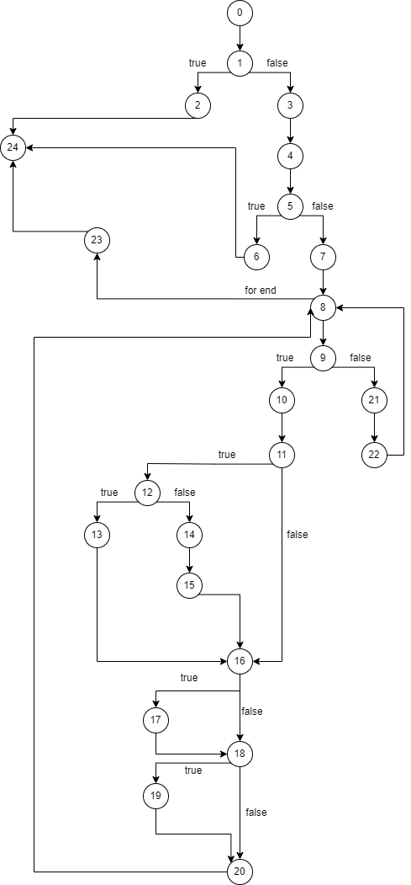

# SI_2022_lab2_173040
Nina Jovanovik 173040

## 2 baranje
Vo kodot oznacena e sekoja linija kod so reden broj kako komentar dodadeni.
Tie redni broevi se koristat vo Control Flow Graph-ot.

## 3 baranje
N=24 (broj na jazli, oznaceni vo samiot kod)
E=32
V(G)=E-N+2=32-24+2=10